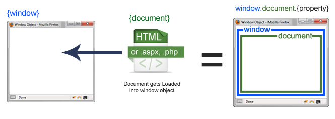

### O que é JavaScript?

<details>
<summary>open content</summary>

É uma linguagem de programação de alto nível que manipula o DOM - Document Object Model do HTML.
<div align="center">

</div>

</details>

## console.log
Permite executar `snippets of code` no navegador, muito usado para testar a saída de códigos, o mais usado é o .log porém existem outros.

<a href="https://developer.mozilla.org/en-US/docs/Web/API/console" target="_blank">Todos os tipos de consoles</a>

## window and document

<div align="center">

 

[fonte img](http://www.cs.ucc.ie/~gavin/javascript/05_JS4.html)
</div>


<hr>
- <a href="https://codepen.io/geraldopcf/pen/jOKNwyM" target="_blank">_representação que fiz no CodePen</a>

## window [MDN](https://developer.mozilla.org/en-US/docs/Web/API/Window)

- window - é um object fundamental no navegador, represeta o que apareçe no document, manipula o BOM "Browser Object Model", é a primeira coisa que é carregada no browser, object global, não é atoa que a função `alert()` originalmente pode ser chamada por como `window.alert("dev");`

- É incomum chamar o window, basta chamar o nome do object ou função, exemplos são apenas para contextualizar o conceito do window e suas propriedades.

```js
console.log("height",window.innerHeight, "Width",window.innerWidth);

window;
window.localStorage;
window.console.log same | console.log
window.screen.height
window.innerHeight
window.open(); // abre nova janela
window.prompt() // get prompt text
window.print();
window.confirm();
console.log(window) - display all objects in window
window.document - display document objects
window.location - vai retornar uma lista de objetos, algums são:
- .pathname
- .href 👉 "new url to redirect"
- .reload() 👉 "reload page"

//tudo que acompanhar nome + parênteses() são funções nativas, você também pode criar as suas.
```
<hr>

## document | [MDN](https://developer.mozilla.org/en-US/docs/Web/API/Document) => [MDN - DOM tree](https://developer.mozilla.org/en-US/docs/Web/API/Document_object_model/Using_the_W3C_DOM_Level_1_Core)


- document - contains the DOM represents any web page loaded in the browser and serves as an entry point into the web page's content, which is the DOM tree.

```js
console.dir(document);  //#document
console.log(document); //#document
```


- Para manipular o DOM, precisamos "falar" com os elementos, pegando o valor atual ou definindo um novo valor começamos por:

`window.document.<something>` ou apenas `document.<something here>` ou 

- From scratch  vamos falar com object global ROOT do DOM: 
**rootElement**:


```js
 //  HTML objects
- document; // #document
- document.documentElement // #rootElement #html
- document.head);
- document.body);
- document.URL);
- document.lastModified); 
- document.title; // currently value
- document.title = "new title"; // set new value for title
- document.write("gmap"); // write text in DOM
- document.domain
- document.URL
- document.all 

```
Mais propriedades e a versão do DOM em que foram adicionadas: 
- [properties and JS events methods | js_htmldom_document.asp](https://www.w3schools.com/js/js_htmldom_document.asp) 

Aqui o uso de da palavra <span style="color:red">document é required</span>, exemplo usando uma função do  `window` com `document`, vai abrir nova janela e escrever o texto.

```js
function abrenovaJanela(){
  open().document.write("oi");  
}
```

<hr>

## Get a Element by ID direct way:  

Todo ID declarado no document é elevado ao scopo global, então é possível chamar diretamente: 
```js
<div id="fibra">Speed</div> 

console.log(window.fibra); // div#fibra
console.log(fibra); // div#fibra - todos os outros objetos acessíveis pelo espaço global

```
apesar de funcionar prefira a boa pratica na page README em <ins>getElements and querySelector</ins> 

<hr>

## DOM - Events

- on + event_name
- addEventListener("name", function(e){}) - consultar README


- get PointerEvent e.g simples, outros consultar a page README

```js
<form name="credito">credito</form>

document.credito.onclick = function(event){
    console.log(event);
  }

//onclick Event and target 
  document.credito.onclick = function(event){
      console.log(event.target); // <form name="credito">credito</form>
    }
```


# DOM Events 
>> mais usados comuns

- click
- change
- input
- mousemove
- mouseover
- mouseleave
- keypress
- error 

[DOM - Events list](https://www.w3schools.com/jsref/dom_obj_event.asp)


- formas de chamar uma function com `onclick`

```js
<button onclick="btn()">btn1</button>
<button id="btn2">btn2</button>
<button name="btn3">btn3</button>

//onclick in html
function btn(){
  alert("hello");
}

//direct
const btn2 = document.getElementById("btn2").onclick = function (){
  alert("hello");
}

//
const btn3 = document.querySelector("button[name='btn3']");
btn3.onclick = function (){
  alert("hello");
}

```
### more in:

- [HTML Objects | dom_obj_document.asp](https://www.w3schools.com/jsref/dom_obj_document.asp)  
- [stackoverflow - windows vs document](https://stackoverflow.com/questions/9895202/what-is-the-difference-between-window-screen-and-document-in-javascript)
- [Evitando populir o objeto-global](http://devfuria.com.br/javascript/objeto-global/)


