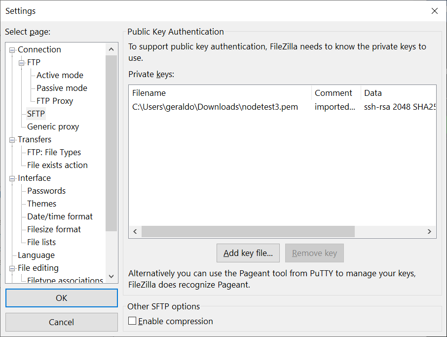
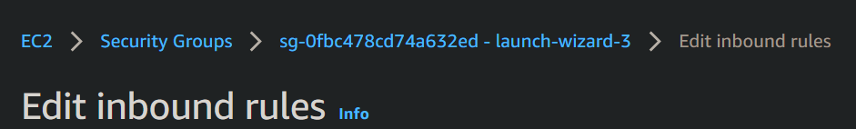
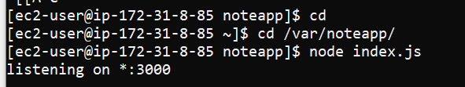
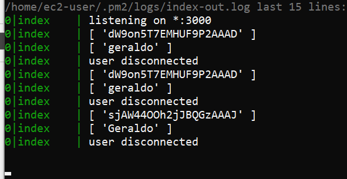

# Setting up Node && NGIX on EC2

1 - Open Windows Power Shell ou cmd

```bash
curl -o- https://raw.githubusercontent.com/nvm-sh/nvm/v0.34.0/install.sh | bash

```

2 - 
```bash
. ~/.nvm/nvm.sh

```

3 - 
```bash
nvm install node

```

4 - check out node version
```bash
node -v
```

5 - check out npm (Node Package Manager)
```bash
npm -v
```

versão v.034.0 não funciona no Amazon Linux, contudo no Ubuntu Server works [https://docs.aws.amazon.com/sdk-for-javascript/v2/developer-guide/setting-up-node-on-ec2-instance.html](https://docs.aws.amazon.com/sdk-for-javascript/v2/developer-guide/setting-up-node-on-ec2-instance.html)

# NGINX

>> Irá trabalhar como reverse proxy

- Install

```bash
sudo yum install nginx

// case No Package is available

sudo amazon-linux-extras install nginx1 

```

- to remove

```bash
sudo yum remove nginx

```

- start

```bash
sudo service nginx start

```

- status

```bash
sudo service nginx status

```


# FileZila setup

SFTP, host, user, password: `<empty>`


Add key.pem



done! just connect.

Login via SSH directory => /var  sudo mkdir nodeapp 


set permission: `sudo chmod -R 777 nodeapp` e fazer o upload de todo o conteúdo

# Inbound rules

Abrir portas 3000 e 5000 ir em:

 

add

 

run app  

 

. 
 

PM2

gerenciador de processos 

`npm install pm2@latest -g`

Checkout digite: `pm2`
<div style="text-align:center">
 
</div>


How pm2: `cd /var/nodeapp`

pm start: `pm2 start index.js`

 

Display window currently process: 
 `pm2 status`

 Display real time process:
 `pm2 log` 

  

 Stop `pm2 stop index.js`


# Nginx reverse

`sudo vim /etc/nginx/nginx.conf`

```shell
    server {
         location / {
                proxy_pass http://localhost:3000/; #whatever port your app runs on

                proxy_http_version 1.1;
                proxy_set_header Upgrade $http_upgrade;
                proxy_set_header Connection 'upgrade';
                proxy_set_header Host $host;
                proxy_cache_bypass $http_upgrade;
         }
    }

```

  

 original

   

  restart 
  `sudo service nginx restart`
