# Setting up Node && NGIX on EC2

1 - Open Windows Power Shell ou cmd

```bash
curl -o- https://raw.githubusercontent.com/nvm-sh/nvm/v0.34.0/install.sh | bash

```

2 -

```bash
. ~/.nvm/nvm.sh

```

3 -

```bash
nvm install node

```

4 - check out node version

```bash
node -v
```

5 - check out npm (Node Package Manager)

```bash
npm -v
```

versão v.034.0 não funciona no Amazon Linux, contudo no Ubuntu Server works [https://docs.aws.amazon.com/sdk-for-javascript/v2/developer-guide/setting-up-node-on-ec2-instance.html](https://docs.aws.amazon.com/sdk-for-javascript/v2/developer-guide/setting-up-node-on-ec2-instance.html)

# NGINX

> > Irá trabalhar como reverse proxy

- Install

```bash
sudo yum install nginx

// case No Package is available

sudo amazon-linux-extras install nginx1

```

- to remove

```bash
sudo yum remove nginx

```

- start

```bash
sudo service nginx start

```

- status

```bash
sudo service nginx status

```

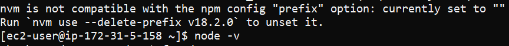

# FileZila setup

SFTP, host, user, password: `<empty>`

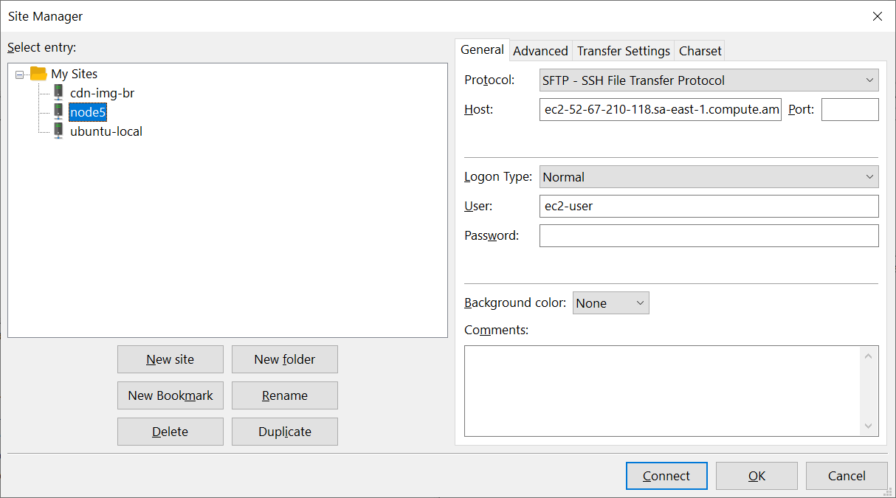

Add key.pem

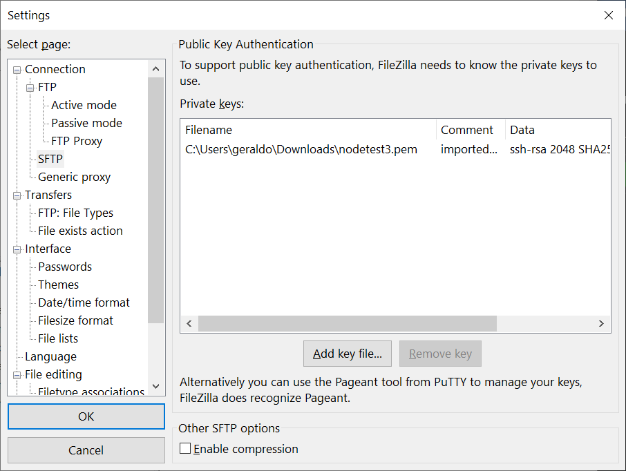

done! just connect.

Login via SSH directory => /var sudo mkdir nodeapp

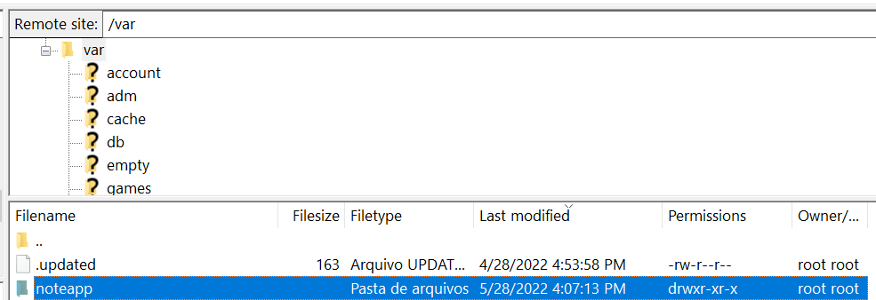

set permission: `sudo chmod -R 777 nodeapp` e fazer o upload de todo o conteúdo

# Inbound rules

Abrir portas 3000 e 5000 ir em:

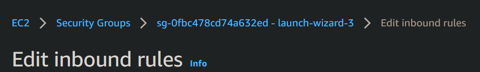

add

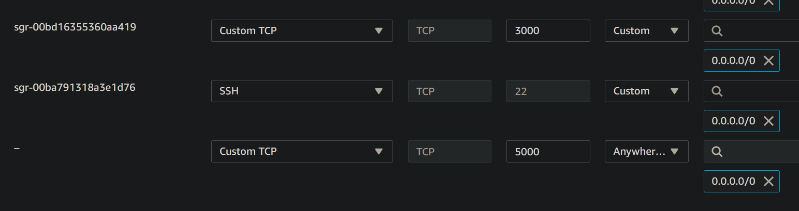

run app

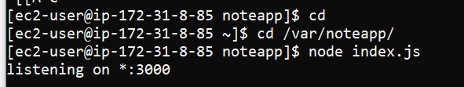

.
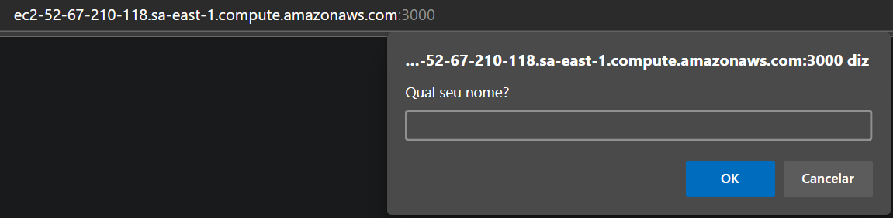

PM2

gerenciador de processos

`npm install pm2@latest -g`

Checkout digite: `pm2`

<div style="text-align:center">
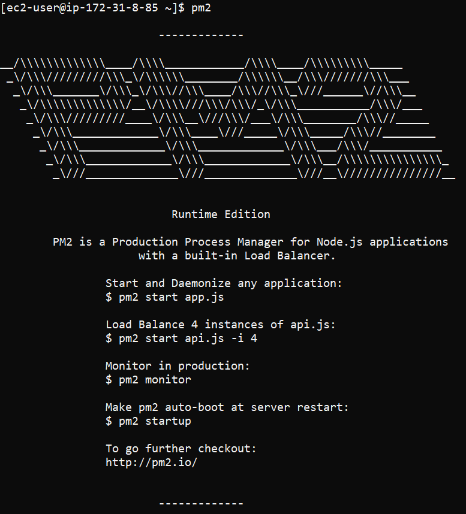 
</div>

How pm2: `cd /var/nodeapp`

pm start: `pm2 start index.js`

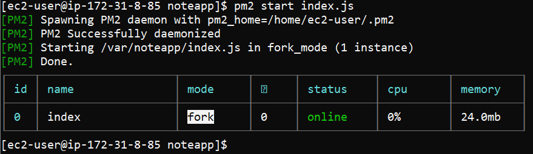

Display window currently process:
`pm2 status`

Display real time process:
`pm2 log`

 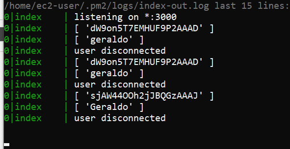

Stop `pm2 stop index.js`

# Nginx reverse

`sudo vim /etc/nginx/nginx.conf`

```shell
    server {
         location / {
                proxy_pass http://localhost:3000/; #whatever port your app runs on

                proxy_http_version 1.1;
                proxy_set_header Upgrade $http_upgrade;
                proxy_set_header Connection 'upgrade';
                proxy_set_header Host $host;
                proxy_cache_bypass $http_upgrade;
         }
    }

```

 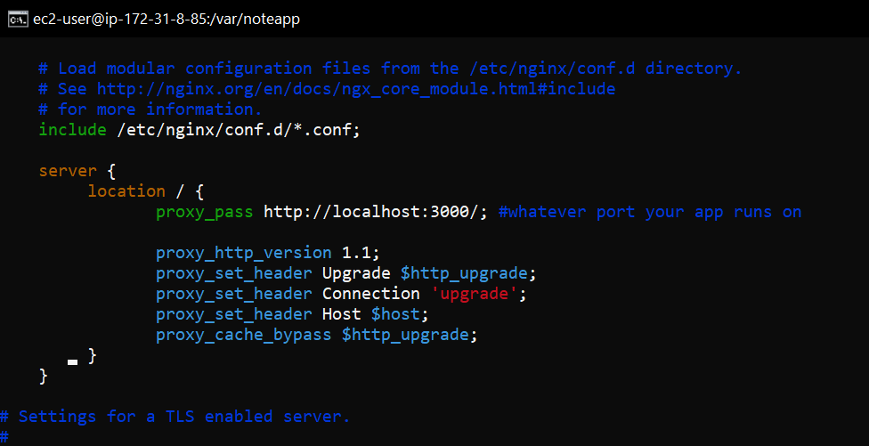

original nginx

  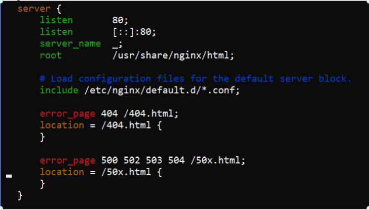

restart
`sudo service nginx restart`

## VPS in General [Updated]

Nginx as reverse intercept connection on specific ports and  redirect them to different destinations based on your configuration.

- 1 - push to github
- 2 - VPS install git and node
  - `apt install git`
  - `apt install npm`
- 3 - clone git repo - eg /var/www/html/myproject
- 4 - install dependences: `node install`
- 5 - run: `node app.js`
- 6 - deixar sempre rodando pm2, gerenciador de processos para o runtime JavaScript Node.js: `npm install pm2 -g`

  - inside project: `pm2 start app.js --name 'My project'`
  - list all projects: `pm2 list`
  - restart by project process ID (PID) of the application: `pm2 restart <pid>`
  - run a npm run dev app `pm2 start "npm run dev" --name crudsqlite`

- 7 - you can access your project in: <IP>:yourport

### how to update project?

```js
pm2 stop <pid>
rm -rf <folder>
git clone  <project>
npm install <folder>
npm2 start <pid>
```

### Setup a domain name with a web server

setup a domain name to your vps ipaddress

- install nginx: `apt install nginx`
- open config nginx: `vi /etc/nginx/sites-available/default`
- service is listening on specific port will be served by nginx, don't need specific folder

```js
server {
    server_name api.gpdev.tech www.api.gpdev.tech; # Adicionar o seu domínio, tanto sozinho quanto com www.
    location / {
        proxy_pass http://localhost:3001; # Supondo que sua API esteja rodando na porta 3001
        proxy_http_version 1.1;
        proxy_set_header Upgrade $http_upgrade;
        proxy_set_header Connection 'upgrade';
        proxy_set_header Host $host;
        proxy_cache_bypass $http_upgrade;
}
}
```

- if default in `/etc/nginx/sites-enabled/` exists: `mv default to default2`
- create symbolic link `ln -s /etc/nginx/sites-available/default /etc/nginx/sites-enabled/`

<details>
<summary>How setup a new site</summary>

```js
nano /etc/nginx/sites-available/crudnodesql.conf

create e new conf
server {
    server_name 143.198.232.51/crudnodesql  ; # Adicionar o seu domínio, tanto sozinho quanto com www.
    location / {
        proxy_pass http://localhost:4000; # Supondo que sua API esteja rodando na porta 4000
        proxy_http_version 1.1;
        proxy_set_header Upgrade $http_upgrade;
        proxy_set_header Connection 'upgrade';
        proxy_set_header Host $host;
        proxy_cache_bypass $http_upgrade;
}
}
```

`ln -s /etc/nginx/sites-available/crudnodesql.conf /etc/nginx/sites-enabled/`

Next, check Nginx for any syntax error with the following command:

`nginx -t`

restat nginx

go to your sites folder mine is /var/www/html
git clone

cd ./-GIT-PROJECT

npm install

npm run dev


Now access: yours routers:
  http://143.198.232.51:4000/

  http://143.198.232.51:4000/pessoas


</details>

## certbot

- depende muito da sua distro checkout => https://certbot.eff.org/instructions?ws=nginx&os=ubuntufocal
- restart nginx - https://phoenixnap.com/kb/nginx-start-stop-restart
