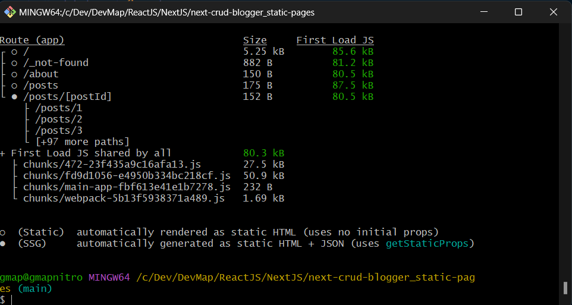

# NextJS

Baseando em convenção de nomes de arquivos e pastas para que as capacidades sejam executadas

- **underscode == privado**

`\_componentes`
`\_files`

### Examples:

- ./next-app-mosh
- ./next-crud-blogger
- [/geraldotech/react-nextjs-api](https://github.com/geraldotech/react-nextjs-api)
- [/geraldotech/god-frontend-code-test](https://github.com/geraldotech/god-frontend-code-test)

### create NextJS 13 app

- `npx create-next-app@13 myappname`
- alias: `@/*`

### create NextJS latest app

- `npx create-next-app@latest`

### create NextJS endpoint

- [Example using endpoint](https://github.com/geraldotech/god-frontend-code-test/tree/master/src)

- create `./public/api/cars.json`
- create `./src/hooks/useCars.tsx`
  - use Axios, fetch
- Na page where want to use this `import { useCars } from '../hooks/useCars'`

### Routers

- [https://nextjs.org/docs/app/building-your-application/routing/route-handlers](https://nextjs.org/docs/app/building-your-application/routing/route-handlers)

  - Criando multirotas: eg: `/shop/roupas/camisas`

  - Adicionar:`[..slug]`
  - Duplo colchetes `[[...slug]]` == params de rota é opcional [Such as](https://github.com/geraldotech/DevMap/blob/main/ReactJS/NextJS/curso-Deck101/next-crud-blogger/app/shopping/%5B%5B...slug%5D%5D/page.js) o que evitaria um erro de 404 como pode ser visto em [example](https://github.com/geraldotech/DevMap/blob/main/ReactJS/NextJS/curso-Deck101/next-crud-blogger/app/shop/%5B...slug%5D/page.js)

### SEO

generateMetadata [ like in](https://github.com/geraldotech/DevMap/blob/main/ReactJS/NextJS/curso-Deck101/next-crud-blogger/app/shop/%5B...slug%5D/page.js#L8)

### Server Component:

create a folder `/src/app/about/page.tsx` so access in `http://127.0.0.1:3000/about`

> page.tsx works like a index

```js
export default function Hello() {
  return <>Hello Router</>
}
```

### Async Component:

create a `/src/app/api/test/route.ts`

```jsx
export async function GET(request: Request) {
  const { searchParams } = new URL(request.url)
  const id = searchParams.get('id')
  const res = await fetch(
    `https://god-frontend-code-test-lime.vercel.app/api/cars`,
    {
      headers: {
        'Content-Type': 'application/json',
        'API-Key': process.env.DATA_API_KEY,
      },
    }
  )
  const product = await res.json()

  return Response.json({ product })
}
```

- [pages/building-your-application/routing/api-routes](https://nextjs.org/docs/pages/building-your-application/routing/api-routes)

```jsx
import { NextResponse } from 'next/server'

export async function GET(request: Request) {
  return NextResponse.json({ messsage: 'Hello World' })
}
```

import from local api and server

```jsx
import { NextResponse } from 'next/server'
import * as dados from '../api/cars.json'

export async function GET(request: Request) {
  return NextResponse.json({ messsage: dados })
}
```

### Redirect

```jsx
import { redirect } from 'next/navigation'

export async function GET(request: Request) {
  redirect('https://nextjs.org/')
}
```

### How deploy NextJS on Vercel

- push project to GitHub
- New project > import
- before change `http://localhost:3000/api/cars` to `process.env.NEXT_PUBLIC_API_URL + '/api/cars'`
- make deploy
- Now set this Environment Variables
  - Name: `NEXT_PUBLIC_API_URL`
  - Value: `https://random-vercel-url.vercel.app/`
- Make a redeploy

### two ways to get URL id

```js
const url = 'http://localhost:3000/api/blogs/20202023'

const id = url.split('blogs/')[1]
console.log(id) // 20202023

// https://youtu.be/-MFiza7ZRzs?t=1692
const onlyid = url.slice(url.lastIndexOf('/') + 1)
console.log(onlyid) // 20202023
```

### Gerar statics pages

- check [next-crud-dynamic-routes](./curso-Deck101/next-crud-dynamic-routes) how to? thanks [DeveloperDeck101](https://youtu.be/g7q0RG1fhLk?t=1409)

- `npm run build`

<div align='center'>

</div>

- `npm run start` test build
