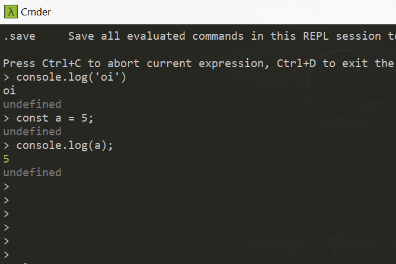
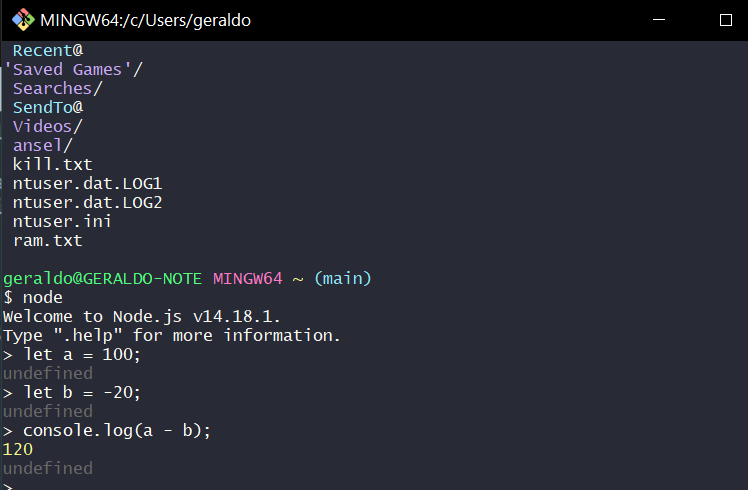

# TypeScript

- [O que é?](#what-is-ts)
- [Install Global Mode](#installing)
- [Sample Hello](#hello-word)
- [tsconfig.json](#config-file)
- [noEmitOnError](#noEmitOnError)
- [Defer](#defer)
- [Hoisting](#hoisting)
- [Types](#types)
- [Terminais e comandos](#terminais)

<hr>
<a name="what-is-ts">O que é o TS?:</a>

**É um superset para a linguagem JavaScript, Ou seja, adiciona funções ao JavaScript, como a declaração de tipos de .variável.**

- Pode ser utilizado com frameworks/libs, como: Express e React;
- Precisa ser compilado em JavaScript, ou seja, não executamos TS;
- Desenvolvido e mantido pela Microsoft

## Installing:
<a name="installing"></a>  
Vamos instalar o TypeScript em modo Global, basta adicionar o -g

```js
npm install -g typescript
```

check ts version:

```js
tsc - v;
```

check node and npm version:

```js
node - v && npm - v;
```

## simples Hello Word

<a name="hello-word"></a>
Fazendo um simples Hello Word, fazer um arquivo vou chamar o meu de `primeiro.ts`:

```ts
const a: string = "Hello World!";
console.log(a);
```

Transpilar: `tsc primeiro.ts`

Note que será criado um novo file chamado `primeiro.js` na raiz da pasta, para ler você pode usar o próprio Node:

```ts
node primeiro.js
```

> > If all okay will be printed Hello Word!

<hr>

## tsconfig.json

<a name="config-file"></a>

O compilador do **TypeScript** é altamente configurável. Ele nos permite definir o local onde estão os arquivos .ts dentro do nosso projeto, o diretório de destino dos arquivos transpilados, a versão ECMAScript que será utilizada, o nível de restrição do verificador de tipos e até se o compilador deve permitir arquivos JavaScript. Cada uma das opções de configuração pode ser passada para um arquivo chamado `tsconfig.json` . Para quem não conhece, esse é o principal arquivo de configuração do _TypeScript_.

Cada uma das opções de configuração pode ser passada para um arquivo chamado _tsconfig.json_ . Para quem não conhece, esse é o principal arquivo de configuração do _TypeScript_.

1 - Começando pelo arquivo de configuração `tsconfig.json`:

```js
tsc --init
```

- Na linha `"outDir": "./dist/js"`, na linha 59 aponte os arquivos que serão emitidos ao client, "arquivos de deploy"

```js
"outDir": "./dist/js/"
```

- Abra o arquivo `tsconfig.json` e na `linha 29 “// "rootDir": "./",”` aponte onde vai ficar o arquivo de TypeScript:

```js
"rootDir": "./src"
```

2 - criar pasta src e `index.ts` file:

```ts
var myname: string = "gmapdev";
console.log(myname);
```

3 - pasta dist será criada o comando `tsc`

4 - criar o `index.html` e adicionar script.js

### watch mode:

```
tsc -w index.ts
```

### Mais sobre tsconfig.json

- Removendo comentários do arquivo compilado:

```ts
"removeComments": true,
```

<hr>

### noEmitOnError

<a name="noEmitOnError"></a>

- Create novo arquivo like index.ts respeitar a converção que os Dev JS utilizam hoje, a utilização do camelCase. e.g? myControls.ts

```js
var languages: Array<string> = [];
languages.push("TypeScript");
languages.push(3);
```

transpilar esse código => `tsc index.ts`

Note que o compilador transpilou o código e gerou o arquivo index.js na mesma pasta dos outros arquivos, mesmo entendendo que tem um erro no código. Agora vem aquela dúvida: o TypeScript não foi desenvolvido para prevenir erros como esse em tempo de desenvolvimento? A resposta é sim. O TypeScript ajuda a prevenir erros como esse em tempo de desenvolvimento, mas para que ele possa alertar ou barrar a geração de arquivos com erro, como o do exemplo anterior, nós devemos informar ao compilador como nós queremos trabalhar com ele através do arquivo tsconfig.json . Para isso, abra o seu arquivo e adicione a seguinte configuração nele:
ou uncomment this line!

```js
"compilerOptions": {
/*outras configurações*/
"noEmitOnError": true
}
```

Essa configuração fará com que o compilador analise o seu código e, caso ele encontre algum erro, não crie o arquivo.js .

###

target - seta a versão do ECMAScript que o projeto deve utilizar. Como default, vem configurado com ES5, mais você pode atualizar para outra versão que vai funcionar normalmente.

## Defer:

<a name="defer"></a>
Defer deixa carregar primeiro HTML:

```js
<script src="./assets/js/index.js" defer></script>
```

# Hosting

<a name="hoisting"></a>

Hoisting traduzindo: elevação, içar é o içamento de funções e variáveis para o topo do scope que são inicializadas com `undefined`, antes da execução do code isso declara as variáveis e funções em memória e permite que você use uma função/variável antes mesmo de declara-la.

## Scope

- Escopo Global
  - Uma variável global é definida quando declaramos uma variável fora de qualquer função, assim ela torna acessível a qualquer parte da nossa aplicação ou site, podendo ser lida e alterada.
- Escopo Local

  - Uma variável se torna local quando ela é declarada dentro de uma função, de tal maneira a qual ela somente estará acessível dentro dessa função.

- Espoco de Bloco
  - Não existia no JS escopo de bloco. Ou seja, for whiles e ifs não tinham escopo próprio. Porém com o ECMAScript 6 foi possível criar escopos de bloco usando as variáveis let e const, que são acessíveis somente dentro do bloco.

# Var

Até a versão ES5 do JavaScript, a declaração de variáveis acontecia por meio da palavra reservada var . Essas variáveis eram conhecidas como variáveis de escopo.

Um escopo no JavaScript é dado por funções e não por blocos, e a palavra reservada `var` permite que a variável declarada dentro de um escopo seja acessada de qualquer ponto de dentro do código. A seguir você tem um exemplo de declaração de variável utilizando o var :

- é içada até o object window
- escopo global e função → n tem escopo de bloco
- Praticamente não são mais usadas em aplicações modernas devidos aos problemas de escopo → substituídas por const e lets
- initialized as `undefined`

```js
var a = "a";
if (5 > 4) {
  var aa = "AA";
}
console.log(a, aa); // a, AA
```

acessar variável antes de ser inicializada

```js
console.log(age); // undefined
age = 8;
console.log(age); // 8 - age foi inicializado
var age;
```

```js
if (true) {
  var global = 2; // vaza de dentro do bloco
}

function teste() {
  var global = 4;
  console.log(global); //4
}

console.log(global); //2 -> acessa a que vazou do if
```

# Let

- é usada para declarar variáveis com escopo de bloco. Seu comportamento é idêntico ao var quando declarada fora de uma function , isto é, ela fica acessível no escopo global. Mas, quando declarada dentro de qualquer bloco, seja ele uma function , um if ou um loop , ela fica acessível apenas dentro do bloco (e sub-blocos) em que foi declarada. Para ficar mais claro, vamos atualizar o exemplo anterior com let .

- is {block scoped}
- let can be updated but not re-declared.
- is not initialized. So if you try to use a let variable before declaration, you'll get a Reference Error.

```js
// will work

let greeting = "say Hi";
greeting = "say Hello instead";

// return an error
let sam = "samsung";
let sam = "samsung"; // 'sam' has already been declared
```

- However, if the same variable is defined in different scopes, there will be no error:

```js
if(true){
let hey = "hello";
console.log(hey); // hello
}

let hey = "how";
console.log(hey); // how

```

Why is there no error? This is because both instances are treated as different variables since they have different scopes. [https://www.freecodecamp.org/news/var-let-and-const-whats-the-difference](https://www.freecodecamp.org/news/var-let-and-const-whats-the-difference/#:~:text=Hoisting%20of%20const&text=var%20variables%20can%20be%20updated,the%20top%20of%20their%20scope.)

- variable declared in a block with let  is only available for use within that block, entretando fora do block scoped é acessível globalmente igual ao var

```js
let b = "b";
if (20 > 30) {
  let bb = "BB";
}

console.log(b);
console.error(bb); // Uncaught ReferenceError: bb is not defined
```

# Const

A palavra reservada `const` é usada para declarar variáveis read-only, isto é, a variável não pode ter o seu valor alterado, seu estado é imutável. Assim como as variáveis declaradas como let e const também ficam limitadas a o block they were declared.

-  cannot be updated or re-declared 
- const object cannot be updated

```js
const mensagem = "MSG 1";
console.log(mensagem); // MSG 1
mensagem = "MSG 2"; // TypeError: Assignment to constant variable. Resultado:

//RESULTADO
// MSG 1
// TypeError: Assignment to constant variable.
```

## Mais exemplos:

Quando declaramos um variável ou função em JS, sua declaração é "elevada" para o topo do escopo, isso permite que você chame uma função/varirável antes mesmo dela ter sido declarada.

- var escopo global vaza, não se usa mais!
- let escopo de bloco, não vaza!
- const espoco de bloco, only read, não muda!

```js
// var
const person = {
  name: "Geraldo",
  age: 29,
  children: true,
};

if (person.age == 29) {
  var msn = "var dentro do if";
}
console.log(msn); // => var dentro do if

//let && const = o que acontece aqui fica aqui!

if (person.children === true) {
  let add = "dependentes";
}

console.log(ads); // => Uncaught ReferenceError:

if (person.name != "Geraldo") {
  const ads = "try again!";
}

console.log(add); // => Uncaught ReferenceError: add is not defined
```

### içamento:

```js
//içamento
console.log(city); //undefined
city = "Maceió";
var city;

//console.log(opt); //Cannot access 'opt' before initialization
//opt = "crédito";
let opt;

//const  é somente leitura, não pode ser reatribuida!
var x = 9;
let y = 10;
const z = 11;
console.log(x); // 9
console.log(y); // 10
console.log(z); /// 11
x = 8;
z = 5;
console.log(x); // 8
console.log(z); /// Uncaught TypeError:
```

## Types:

<a name="types"></a>

### Boolean:

Agora entrando nos types, iniciaremos com os tipos booleanos. Como em outras linguagens tipadas, o Boolean suporta dois tipos de valores: true ou false .

```ts
let ativo: boolean;
ativo = false;
ativo = true;
```

Nós também podemos declarar uma variável sem o seu type, basta passar o seu valor inicial:

```ts
let ativo: boolean = true;
```

### Number:

valores como floating, decimal, hex, octal deve ser tipados como number
A seguir você tem um exemplo com os tipos numéricos suportados:

```ts
let octal: number = 0o745;
let binary: number = 0b1111;
let decimal: number = 34;
let hex: number = 0xf34d;
```

### String:

As strings armazenam valores do tipo texto. Diferente de outras linguagens de programação, no JavaScript/TypeScript nós podemos declarar uma string em aspas simples e aspas duplas.

```ts
let cor: string = "verde";
cor = "azul";
```

Nós também podemos declarar uma variável do tipo string utilizando template strings, dessa forma nós podemos concatenar valores:

```ts
let nome: string = 'Anders Hejlsberg';
let idade: number = 58;
let sentence: string = `Olá, meu nome é ${ nome }, eu tenho ${idade} anos.
```

### Length:

adicionar ao final de um string para obter o tamanho dela.

```ts
var nome: string = "Geraldo";
let sentence: string = `Olá, meu nome ${nome}`;
console.log(sentence.length);
```

run tsd file.ts para gerar o .js e depois node file.js

```ts
var nome: string = "Geraldo";
var idade: number = 29;
let sentence: string = `Olá, meu nome ${nome} eu tenhjo ${idade} anos`;
console.log(sentence);
console.log(sentence.length);
```

### IndexOf:

Nos permite encontrar a posição de m caractere ou string. Caso não exista é retornado o valor -1.

Para ficar mais claro, vamos utilizar esse método no nosso exemplo anterior, para que ele retorne a posição da palavra nome dentro da variável sentence .

```ts
//outras variáveis
let sentence: string = `Olá, meu nome é ${nome}, eu tenho ${idade} anos.`;
console.log(sentence.indexOf("nome")); //posição 9
```

```ts
let sentence: string = `Olá, meu nome ${nome} eu ${surname} tenho ${idade} anos`;
console.log(sentence);
console.log(sentence.length); //44
console.log(sentence.indexOf("nome")); //9
console.log(sentence.indexOf("idade")); //-1
```

Note que ele retornou -1 para idade . Isso aconteceu porque essa palavra é uma variável e não um valor dentro da string.

### Array:

Como em outras linguagens de programação, nós declaramos um array no TypeScript utilizando as chaves [] .

```ts
let numeros: number[] = [1, 2, 3];
let textos: string[] = ["exemplo 1", "exemplo 2", "exemplo 3"];
```

Ou nós podemos utilizar a palavra reservada Array<> , como no exemplo a seguir:

```ts
const arr: Array<number> = [100, 5, 23, 5];
```

REPL stands for **Read Evaluate Print Loop**

- Type Annotation:
  é quando definimos o tipo de dados manualmente.

- Type Inference:
  é quando o TS identifica e define o tipo de dados para nós.

### Terminais

<a name="terminais"></a>




Comandos úteis para produtividade:

```
mkdir | create folders
touch | create files
rm -rd | delete folders
rm | delete files
echo "# oi" >> style.css | create file and write
cat | read file content
```
